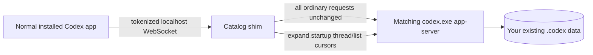

# Codex All Chats Shim

Load the complete local task catalog in the normal, installed Codex desktop app without modifying its signed files or using a separate Electron profile.

## What It Does

The current Codex desktop renderer discovers only a bounded number of recent tasks during startup. This can leave valid local projects showing `No chats` even though their tasks are present in `state_5.sqlite` and can be opened by ID.

Codex already supports an external app-server WebSocket endpoint through `CODEX_APP_SERVER_WS_URL`. This project uses that existing boundary:

1. Launch a tokenized loopback WebSocket service.
2. Proxy ordinary app-server traffic unchanged to the exact `codex.exe` installed with Codex.
3. Intercept only the expanded, non-archived startup `thread/list` request.
4. Follow every app-server cursor with `modelProviders: []` and `useStateDbOnly: true`.
5. Return one lightweight summary catalog to the normal renderer.

The app still hydrates only its normal recent working set. Older tasks remain lightweight summaries until opened, avoiding the severe lag caused by eagerly constructing full reactive conversation objects for the entire catalog.



## Requirements

- Windows 10 or 11.
- The Microsoft Store/OpenAI Codex desktop app installed.
- Node.js 20.11 or newer.
- PowerShell 5.1 or newer.

## Setup

```powershell
git clone https://github.com/RyanCraighead/codex-all-chats-shim.git
cd codex-all-chats-shim
npm run setup
```

Setup performs these local-only steps:

- installs the single `ws` dependency;
- detects the installed `OpenAI.Codex` package;
- records the installed package version and SHA-256 in `config.local.json`;
- copies that machine's `codex.exe` into `%LOCALAPPDATA%\CodexAllChatsShim\bin\<sha256>\` so Node does not have to spawn from protected `WindowsApps` storage;
- creates a `Codex - All Chats` desktop shortcut.

Neither `config.local.json` nor the copied binary is committed or distributed.

## Use

Close Codex, then launch **Codex - All Chats** from the desktop.

To queue the same close/relaunch flow while Codex is open:

```powershell
npm run queue
```

The queue command does not force-close Codex. It waits in the background, then starts the shim and reopens the same installed app after you close it.

Other commands:

```powershell
npm run launch     # Launch after Codex is already closed
npm run shortcut   # Recreate the desktop shortcut
npm run test       # Run the app-server simulator test suite
npm run test:live  # Read-only smoke test against your local catalog
```

## What Stays Unchanged

- The signed Codex application and `app.asar` are not edited.
- Codex uses its default Electron profile.
- Codex uses the existing `%USERPROFILE%\.codex` home, account, model providers, plugins, and settings.
- Chat bodies, tools, file changes, and turns are read normally when a task is opened.
- Archived tasks remain under Archived chats.
- Subagent tasks remain attached to their parent task instead of being flattened into project lists.

## Security

- The server binds only to `127.0.0.1`.
- Every process start generates a random 256-bit WebSocket path.
- Requests to the fixed root path receive `404`.
- The tokenized URL is passed only to the launched Codex process.
- The shim never sends chat data over the network.

See [SECURITY.md](SECURITY.md) for the trust model and reporting guidance.

## Codex Updates and Version Pinning

### Short answer

The shim is **not guaranteed to keep working automatically after a Codex update**. It intentionally fails closed until the new build is explicitly detected and tested.

`config.local.json` pins both the installed Codex package version and the exact `codex.exe` SHA-256. When Codex updates:

- an already-running Codex session is not modified;
- the **Codex - All Chats** launcher detects the mismatch and stops before starting an unverified shim;
- no chat database, rollout, configuration, or application file is changed;
- the ordinary Codex shortcut remains available and launches Codex without this shim.

### What each command proves

| Command | What it does | What it does not prove |
| --- | --- | --- |
| `npm run setup` | Detects the newly installed package, copies its CLI into the user-owned runtime directory, and writes the new version/hash pin. | It does not prove that the new internal protocol or renderer is compatible. |
| `npm test` | Tests cursor aggregation, request pass-through, and tokenized WebSocket access against the included app-server simulator. | It does not communicate with the installed Codex build. |
| `npm run test:live -- -RestartShim` | Runs a read-only catalog and `thread/read` smoke test against the newly installed real app-server. | It does not prove that the desktop renderer still consumes the expanded catalog. |
| `npm run launch` | Launches the normal installed app through the verified app-server path. | The final sidebar check is visual and must be confirmed in the app. |

### Required update procedure

After Codex updates:

1. Close Codex.
2. Run the compatibility sequence:

   ```powershell
   npm run setup
   npm test
   npm run test:live -- -RestartShim
   npm run launch
   ```

3. In Codex, confirm that a previously old/missing project displays its tasks and that one of those tasks opens normally.

If any command fails, do not use the **Codex - All Chats** shortcut for that version. The regular Codex shortcut is unaffected. Report the installed package version and the relevant files from `logs/` so the shim can be updated.

A code update may be required if Codex changes or removes `CODEX_APP_SERVER_WS_URL`, changes the `thread/list` protocol, or changes how the renderer builds its lightweight task catalog.

## Troubleshooting

Logs are written under `logs/`:

- `catalog-shim.log`
- `launcher.log`
- `queue.log`

If the desktop shortcut does nothing, inspect `logs/launcher.log`. A version mismatch means the full update procedure above must be completed; rerunning setup alone is not sufficient validation.

## Status

This is an interoperability project for user-owned local data. It is not affiliated with or endorsed by OpenAI. Codex updates can require compatibility changes.
