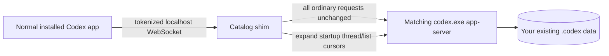

# Codex All Chats Shim

> [!WARNING]
> **This project is retired and this repository is archived.** Active development has moved to [Codex Patch Studio](https://github.com/RyanCraighead/codex-patch-studio-current). This repository is retained as historical reference and receives no maintenance, compatibility updates, or support. As of July 18, 2026, the successor repository requires authorized collaborator access and is not publicly accessible.

Load the complete local task catalog in the normal, installed Codex desktop app without modifying its signed files or using a separate Electron profile.

## What It Does

The current Codex desktop renderer discovers only a bounded number of recent tasks during startup. This can leave valid local projects showing `No chats` even though their tasks are present in `state_5.sqlite` and can be opened by ID.

Codex already supports an external app-server WebSocket endpoint through `CODEX_APP_SERVER_WS_URL`. This project uses that existing boundary:

1. Launch a tokenized loopback WebSocket service.
2. Proxy ordinary app-server traffic unchanged to the exact `codex.exe` installed with Codex.
3. Intercept only the expanded, non-archived startup `thread/list` request.
4. Follow every app-server cursor with `modelProviders: []` and `useStateDbOnly: true`.
5. Return one lightweight summary catalog to the normal renderer.

The app still hydrates only its normal recent working set. Older tasks remain lightweight summaries until opened, avoiding the severe lag caused by eagerly constructing full reactive conversation objects for the entire catalog.



## Requirements

- Windows 10 or 11.
- The Microsoft Store/OpenAI Codex desktop app installed.
- Node.js 20.11 or newer.
- PowerShell 5.1 or newer.

## Setup

```powershell
git clone https://github.com/RyanCraighead/codex-all-chats-shim.git
cd codex-all-chats-shim
npm run setup
```

Setup performs these local-only steps:

- installs the single `ws` dependency;
- detects the installed `OpenAI.Codex` package;
- records the installed package version and SHA-256 in `config.local.json`;
- copies that machine's `codex.exe` into `%LOCALAPPDATA%\CodexAllChatsShim\bin\<sha256>\` so Node does not have to spawn from protected `WindowsApps` storage;
- creates a `Codex - All Chats` desktop shortcut.

Neither `config.local.json` nor the copied binary is committed or distributed.

## Use

Close Codex, then launch **Codex - All Chats** from the desktop.

To queue the same close/relaunch flow while Codex is open:

```powershell
npm run queue
```

The queue command does not force-close Codex. It waits in the background, then starts the shim and reopens the same installed app after you close it.

Other commands:

```powershell
npm run launch     # Launch after Codex is already closed
npm run shortcut   # Recreate the desktop shortcut
npm run test       # Run the app-server simulator test suite
npm run test:live  # Read-only smoke test against your local catalog
```

## What Stays Unchanged

- The signed Codex application and `app.asar` are not edited.
- Codex uses its default Electron profile.
- Codex uses the existing `%USERPROFILE%\.codex` home, account, model providers, plugins, and settings.
- Chat bodies, tools, file changes, and turns are read normally when a task is opened.
- Archived tasks remain under Archived chats.
- Subagent tasks remain attached to their parent task instead of being flattened into project lists.

## Security

- The server binds only to `127.0.0.1`.
- Every process start generates a random 256-bit WebSocket path.
- Requests to the fixed root path receive `404`.
- The tokenized URL is passed only to the launched Codex process.
- The shim never sends chat data over the network.

See [SECURITY.md](SECURITY.md) for the trust model and reporting guidance.

## Codex Updates and Version Pinning

The shim uses two separate pins with different responsibilities:

| Pin | Location | Purpose |
| --- | --- | --- |
| Verified compatibility pin | `compatibility/verified-codex.json` in Git | Records the package version and exact `codex.exe` SHA-256 that passed the Gitea Windows validation pipeline. |
| Local runtime pin | uncommitted `config.local.json` | Records the exact installed package and user-owned CLI copy used by this machine's launcher. |

The repository pin is the compatibility approval. The local pin prevents the launcher from silently switching to a different executable. Running `npm run setup` refreshes only the local pin; it does **not** prove or publish compatibility.

### Automatic release flow

Gitea is the canonical repository and runs the update monitor every six hours:

1. A Windows 11 runner refreshes the official Microsoft Store Codex package.
2. The monitor records the package version and exact CLI SHA-256.
3. A new identity creates an immutable `automation/codex-candidate/...` branch.
4. The candidate runs repository tests plus a real, isolated `codex.exe app-server` fixture containing 125 synthetic local tasks.
5. Validation checks multi-page `thread/list`, 125 unique task IDs, `thread/read`, and the shim's complete cursor aggregation without making a model request or reading user chats.
6. A passing candidate is fast-forwarded into Gitea `main` with compact evidence under `compatibility/verification/` and a `codex-verified/...` tag.
7. A separate Linux workflow fast-forwards that exact Gitea commit to GitHub.

Failed candidates remain available for diagnosis but cannot update Gitea `main`. Stale candidates, non-fast-forward promotions, and a divergent GitHub mirror all fail closed. GitHub receives only builds already verified on Gitea.

See [Release automation](docs/release-automation.md) for the runner architecture, workflow details, secrets, and recovery procedures.

### What happens on a user's machine

When the Microsoft Store updates Codex, an existing Codex session is left alone. The next **Codex - All Chats** launch compares the installed package with `config.local.json` and stops on a mismatch before starting the shim. It does not modify chats, rollouts, settings, or signed application files, and the ordinary Codex shortcut remains usable.

After the new identity has been promoted:

```powershell
git pull --ff-only
npm run setup
npm run launch
```

The version and `upstreamCliSha256` written to `config.local.json` should match `compatibility/verified-codex.json`. If they do not match, do not use the shim with that build; wait for or manually dispatch the Gitea monitor.

### Manual validation fallback

If Gitea is unavailable, a local read-only check can provide diagnostic evidence:

```powershell
npm run setup
npm test
npm run test:live -- -RestartShim
```

This fallback tests only that machine and does not promote a release, update Gitea, or mirror GitHub. It is not equivalent to the automated candidate gate. A code change may still be required if Codex changes `CODEX_APP_SERVER_WS_URL`, the app-server protocol, or the renderer's catalog behavior.

## Troubleshooting

Logs are written under `logs/`:

- `catalog-shim.log`
- `launcher.log`
- `queue.log`

If the desktop shortcut does nothing, inspect `logs/launcher.log`. A version mismatch means the Store package changed. Pull the latest verified repository state first, confirm its package identity matches the installed build, and only then refresh the local pin with `npm run setup`.

## Status

This is an interoperability project for user-owned local data. It is not affiliated with or endorsed by OpenAI. Codex updates can require compatibility changes.
