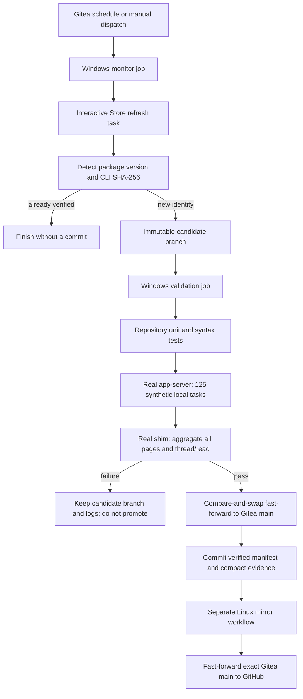

# Release Automation

Gitea is the canonical repository and audit log for Codex compatibility. GitHub is a publication mirror that receives only commits already verified on Gitea.

## Flow



The Windows test is headless. It launches the exact candidate `codex.exe app-server`, but it does not launch the desktop renderer or make a model request. This keeps the gate deterministic while still testing the internal protocol and shim behavior that the project depends on.

## Repository State

- `compatibility/verified-codex.json` is the currently promoted package identity.
- `compatibility/candidate.json` exists only on an immutable candidate branch.
- `compatibility/verification/<version>-<hash>.json` contains sanitized evidence for a promoted build.
- Candidate branches use `automation/codex-candidate/<version>-<hash>-<base>`.
- Verified tags use `codex-verified/<version>-<hash>`.

No Codex executable, user chat, API key, VM path, or raw runner log is committed.

## Required Runners

### Windows compatibility runner

The Windows 11 VM runs `act_runner` directly on the Windows host and advertises the label `windows-11-codex`. It is responsible for:

- accessing the installed Microsoft Store package;
- caching the exact candidate CLI under `C:\ProgramData\CodexShimCI\candidates\<sha256>\codex.exe`;
- running PowerShell, Node.js, and the real app-server;
- validating the multi-page task fixture and shim.

The Store package must be refreshed in an interactive desktop user session. Install the bridge once from that Windows session:

```powershell
.\scripts\ci\install-store-refresh-task.ps1 -RunNow
```

The Gitea runner invokes that task with `scripts/ci/invoke-store-refresh-task.ps1` and waits for a fresh status file. The task itself uses the official Store product ID `9PLM9XGG6VKS`.

### Linux coordination runner

The existing `ubuntu-latest` runner performs only the final Gitea-to-GitHub Git mirror. It does not validate Windows behavior and does not control the Windows VM.

## Required Gitea Secrets

Create these as repository-level Actions secrets:

| Secret | Purpose |
| --- | --- |
| `AUTOMATION_TOKEN` | PAT for a restricted bot collaborator with `write:repository`; used for candidate and verified fast-forward pushes. |
| `MIRROR_SSH_KEY` | Private half of a GitHub deploy key with write access to this repository only. |
| `MIRROR_KNOWN_HOSTS` | Pinned GitHub SSH host key entries. |

Do not name secrets with a `GITEA_` or `GITHUB_` prefix; Gitea reserves those prefixes.

The automation identity should be a restricted bot with write access to only this repository. It does not need Gitea administrator access. The GitHub key should be a repository deploy key, not a personal SSH key.

## Workflows

### `codex-update-monitor.yml`

Runs every six hours and on manual dispatch. It refreshes the Store package, detects the candidate identity, and creates a candidate branch only when the version or CLI hash differs from the verified manifest.

### `validate-codex-candidate.yml`

Runs for `automation/codex-candidate/**` pushes. It validates the exact SHA-addressed CLI, then promotes only when all checks pass. Promotion verifies that Gitea `main` still equals the candidate's recorded base and uses a normal non-force push. A race or later main commit therefore fails closed.

### `mirror-github.yml`

Runs only after a Gitea `main` push or manual dispatch. It requires the current GitHub `main` to be an ancestor of Gitea `main` and then performs a fast-forward push. Divergence is reported instead of overwritten.

## Manual Operations

To force an update check, open the Gitea repository's Actions page and dispatch **Monitor Codex desktop updates**. A new candidate branch should cause **Validate and promote Codex candidate** to start automatically.

Normal outcomes:

- No new package: monitor succeeds and creates nothing.
- New compatible package: candidate, validation, promotion, then mirror all succeed.
- New incompatible package: candidate remains for investigation; Gitea and GitHub `main` remain on the last verified build.
- Stale candidate: promotion refuses to run because its recorded base is no longer current.
- GitHub divergence: mirror refuses to force-push and leaves both repositories unchanged.

## Updating The Automation

Pipeline changes should be developed in a separate worktree and reviewed like ordinary code. Test PowerShell parsing recursively, run `npm test`, and validate the release scripts before merging them into Gitea `main`. Once merged, Gitea remains the canonical history; GitHub should be updated only by the mirror workflow.
